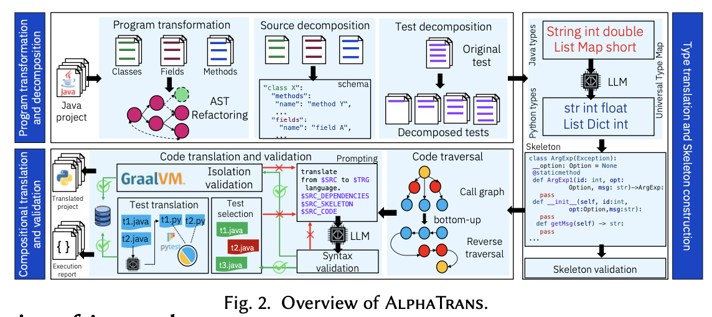

# AlphaTrans: Repository-Level Code Translation and Validation

AlphaTrans is a compositional and validated code translation framework that enables accurate, repository-scale migration of codebases (e.g., from Java to Python). It combines static analysis, prompt-based LLM translation, and automated test validation to ensure correctness at every step of translation.

## Overview

AlphaTrans performs **bottom-up, fragment-level translation**, guided by the **call graph** of the original Java project. Each translation step is coupled with automatic validation using syntax checks, GraalVM isolation, and translated test execution.

1. Translates entire projects incrementally and modularly.

2. Validates functional correctness using unit tests, GraalVM, and syntactic checks.

3. Leverages LLMs for in-context translation of code fragments.

4. Integrates feedback loops and test-guided repair for improved translation quality.

## Challenges
1. **Long call chains & interprocedural dependencies** make monolithic translation infeasible.

2. Unit tests may **span multiple methods** and data flows.

3. Validation must be granular, automated, and scalable.

## Key points
- **Skeleton Construction**: Builds a Python project skeleton from Java source, including placeholders for fields and methods.

- **Compositional Translation**: Translates methods in **reverse topological order** of the call graph to maintain correctness.

- **Test Decomposition**: Splits complex unit tests into smaller, executable fragments to validate translated components.

- **Validation Pipeline**:
  - Syntactic parsing
  - GraalVM-based equivalence checking
  - Executable test translation and runtime checks

- **Adaptive Feedback Loop**: Uses test coverage to prioritize retranslation of suspicious fragments with dynamic reprompting budgets.

## Additional notes

Q1. How do skeleton construction work?

A1. Here are the Key Steps:
1. Class Stubs Generation:

    - Each Java class is converted into a Python class with the same name.

    - Fields are initialized to `None` and typed using universal type mapping.

    - Access modifiers are reflected using naming conventions (e.g., `private Option option;` → `__option: Option = None`).

2. Method Signatures:

    - Each method is stubbed with correct names and parameters but an empty body (`pass`).

    - Types in signatures are preserved via a language-neutral schema.

3. Handling Java-Specific Constructs:

    - Circular dependencies: Resolved via local imports.

    - Inner classes: Flattened and accessed via `OuterClass.InnerClass`.

    - Interfaces & abstract classes: Translated into Python classes inheriting from `abc.ABC`.

Q2. How do compositional Translation and Validation work?

A2. The translation pipeline is organized as follows:

1. Dependency Ordering:

    - Java methods are ordered via a reverse topological sort of the acyclic call graph.

    - For examples, fields are translated first, followed by methods.

2. Fragment Translation:

    - For each fragment, AlphaTrans constructs a detailed prompt using:
        - Persona header: guided the model to use instruction-tuned mode（like DeepSeek-Coder）

        - ICL Examples

        - Translation instruction

        - Source Java code + partially filled Python skeleton

3. Validation Stages:

    - Syntax Check: Ensures the Python code is parsable.

    - GraalVM Execution: Executes the fragment in isolation (if a test covers it).

    - Test Translation & Execution: Tests covering the fragment are translated and run to ensure behavioral correctness.

4. Feedback Loop:

    - If any check fails, AlphaTrans would:

      - Extracts feedback (e.g., error messages)

      - Reprompts the model with adjustments

      - Uses a dynamic reprompting budget based on test coverage

      - Prioritizes heavily-tested fragments for improved reliability

5. Suspiciousness-Based Repair:

    - If a translated test fails, AlphaTrans ranks the contributing fragments by a suspiciousness score.

    - The top-k most suspicious fragments are retranslated with test-derived feedback.

## Advantages
1. Ensures translation quality even for large, real-world projects

2. Modular architecture enables parallel translation and validation

3. Reduces manual post-editing by applying test-guided correction loops

## Phase 1 Applicability

### Reusable ideas:

1. **Cross-language Unit Test Decomposition**:
The test decomposition strategy of splitting complex C unit tests into smaller fragments based on function calls can be reused across other translation pipelines (e.g., C++→Rust) to isolate translation failures and improve test coverage granularity.
2. **Partial Compilation and Test Execution Framework**:
The ability to insert translated Rust fragments into a skeleton for partial compilation and testing is reusable for other scenarios like incremental refactoring or multi-stage code migration.
3. **Symbolic Call Graph Utilization**:
The use of C call graphs (via static analysis tools like cflow or clang) to determine translation order is a general technique that can benefit other compositional code transformations beyond Rust (e.g., to move procedural C code to modular or object-oriented designs).

### Limitations
Pointer Aliasing and Unsafe Memory Semantics:

- In C, pointers can refer to the same memory location (aliasing), and code often uses pointer arithmetic or manual memory management (like malloc and free).

- The framework currently can’t fully understand or reason about these complex memory behaviors.

- So, when translating such code to Rust, manual adjustments or Rust’s unsafe code blocks may be needed to handle these cases safely.