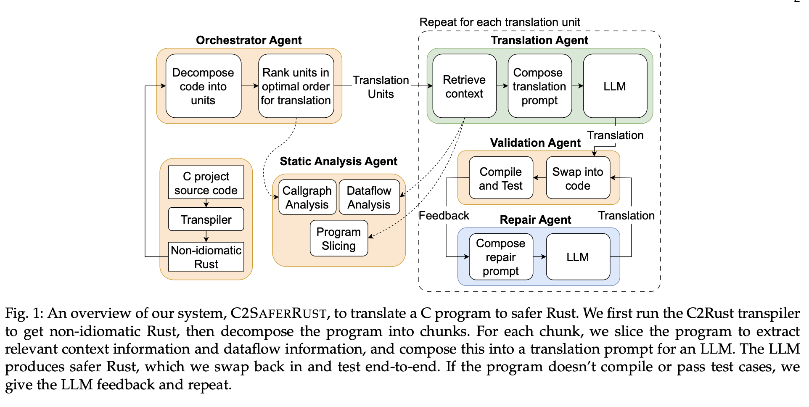

# C2SAFERRUST: Transforming C Projects into Safer Rust with NeuroSymbolic Techniques

## Overview

**C2SAFERRUST** is a **neuro-symbolic system** that combines symbolic reasoning (i.e., program analysis) with large language models (LLMs) to translate C code into **safer Rust** code.

🔄 **Workflow Steps:**

1. **C2Rust converts the original C code into unsafe Rust.**
    
2. **The unsafe Rust code is split into small units** (such as individual functions).
    
3. **Static program analysis is used to collect:**
    
    - **Function call dependencies** (callgraph)
        
    - **Data flow relationships** (dataflow)
        
4. **For each unit**, a tailored prompt is created and fed to an **LLM to generate safer Rust code**.
    
5. **After each unit is translated**, the code is **compiled and tested** to ensure functional correctness.
    
6. **If the translation fails** (due to compilation errors or test failures), **feedback is sent to the LLM** for **iterative repair** (feedback-guided refinement).

### Challenges and why is this system needed?

- Translating a full C project into Rust **in one go is infeasible** due to the project's size and complexity.
    
- C2SAFERRUST solves this by translating the code **piece by piece** and **validating** each translated unit incrementally.
    
- The system relies on C2Rust to first produce **unsafe Rust** as a bridge between C and safe Rust.
    
- This unsafe Rust allows execution within a Rust environment, while still retaining the original structure and semantics of the C code.

### Key Components of the System

#### 1. **Translation Orchestrator**

- Splits the codebase into small parts (called **translation units**, e.g., functions).
    
- Uses **static analysis** to determine an **optimal translation order** based on dependencies.
    
- Ensures that side effects are translated in the right order to maintain correctness.
    

#### 2. **Static Analyzer**

- Performs static program analysis to gather:
    
    - **Call graph** (function call dependencies)
        
    - **Dataflow information** (how variables are read and written)
        
- Since the program changes after each translation, this analysis is re-run **after every step**.
    

#### 3. **Translation**

- For each translation unit:
    
    - Creates a **custom prompt** for the LLM that includes both the code and its context (dependencies, call relationships).
        
    - The LLM uses this to translate the **unsafe Rust** code into **safe Rust**.
        

#### 4. **Validator**

- After translation, the system:
    
    - **Compiles** the code
        
    - **Runs test cases** (taken from the original C project)
        
- This ensures that the translated code is still functionally correct.
    
- Allows **safe and unsafe Rust** code to **coexist** during the migration.
    

#### 5. **Repair**

- If the new code **fails** to compile or pass tests:
    
    - The system collects **error messages** and gives them to the LLM as **feedback**.
        
    - The LLM is then asked to **regenerate the translation**.
        
- Each unit is retried up to **N times**. If it still fails, the system keeps the original unsafe version to maintain correctness.