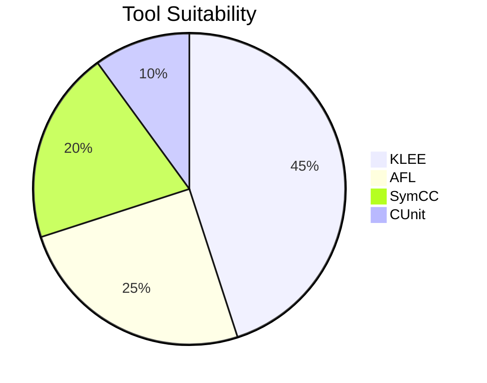

# Automated Test Generation with KLEE - Phase 1 Report

## Table of Contents
- [Tool Research](#tool-research)
- [Selected Tool](#selected-tool)
- [C Program Implementation](#c-program-implementation)
- [Experimental Process](#experimental-process)
- [Test Generation Results](#test-generation-results)
- [Issues & Solutions](#issues--solutions)
- [Conclusion](#conclusion)

---

## Tool Research

### Comparison of Testing Tools

| Tool  | Technology       | Best For              | Pros                                  | Cons                                |
|-------|-----------------|-----------------------|---------------------------------------|-------------------------------------|
| KLEE  | LLVM-based symbolic execution | C unit testing, boundary analysis | Automatic test generation, memory error detection | Path explosion, requires LLVM setup |
| CUnit | xUnit framework | Regression testing    | Lightweight, test suite management    | Manual test writing                 |
| SymCC | QEMU hybrid execution | Binary analysis      | No recompilation needed               | Slow execution                      |
| AFL   | Genetic fuzzing | Crash detection       | Great path exploration                | Poor complex logic coverage         |

---

## Selected Tool

**Chose KLEE because:**
✔️ Fully automated test generation  
✔️ Deep path exploration  
✔️ Academic and industry validation  



---

## C Program Implementation
### Features
1. Input: Day number (1-7) <br>
2. Output: Activity suggestion<br>
3. Error handling: Invalid inputs<br>

### Targeted Code
```c

#include <klee/klee.h>

/**
 * Suggests activities based on day of week
 * @param day Integer representing day (1=Monday through 7=Sunday)
 */
void suggest_activity(int day) {
    // Input validation
    if (day < 1) {
        klee_report_error("Invalid input", 0, "Day must be greater than 0", "");
        return;
    }
    else if(day > 7) {
        klee_report_error("Invalid input", 8, "Day must be less than 8", "");
    }

    // Activity mapping
    switch (day) {
        case 1: 
            klee_print_expr("Monday: Work", day);
            break;
        case 2: 
            klee_print_expr("Tuesday: Study", day);
            break;
        case 3: 
            klee_print_expr("Wednesday: Exercise", day);
            break;
        case 4: 
            klee_print_expr("Thursday: Watch movie", day);
            break;
        case 5: 
            klee_print_expr("Friday: Party", day);
            break;
        case 6: 
            klee_print_expr("Saturday: Outing", day);
            break;
        case 7: 
            klee_print_expr("Sunday: Rest", day);
            break;
    }
}

int main(int argc, char **argv) {
    (void)argc; (void)argv; // Suppress unused parameter warnings
    
    int input_day;
    // Create symbolic variable for KLEE analysis
    klee_make_symbolic(&input_day, sizeof(input_day), "input_day");
    suggest_activity(input_day);
    return 0;
}

```


## Experimental Process

### Environment setup
```bash
# Using mirror of official KLEE Docer
docker pull klee/klee:2.3
docker run -it --ulimit='stack=-1:-1' klee/klee:2.3

# creating working directory
mkdir phase1 && cd phase1

# Write code into demo.c file
cat > demo.c << "EOL"
```
### Code compilation
```bash
clang -I /home/klee/klee_src/include -emit-llvm -c -g demo.c
```

### Run KLEE

```bash
klee --libc=uclibc --optimize demo.bc
```
### KLEE stats on generated test cases

```bash
# Check Instructions Coverage, etc.
klee-stats --to-table klee-last

# Check individual case
ktest-tool klee-last/test000001.ktest

```

## Test generation outcome

### Statistics
|Metric	|Value|
|------|------|
|Total Instructions|	12,168|
|Completed Paths|	7|
|Partially Completed Paths|	2|
|Generated Test Cases|	9|


### Test Case Display

|Test Case File|	Input| Value|	Covered Path|	Expected Output|	Status|
|------|------|-------|------|-------|------|
|test000001.ktest|	1|	Valid Path|	Monday: Work|	✓|
|test000002.ktest|	2|	Valid Path|	Tuesday: Study|	✓|
|test000003.ktest|	3|	Valid Path|	Wednesday: Exercise|	✓|
|test000004.ktest|	4|	Valid Path|	Thursday: Watch movie|	✓|
|test000005.ktest|	5|	Valid Path|	Friday: Party|	✓|
|test000006.ktest|	6|	Valid Path|	Saturday: Outing|	✓|
|test000007.ktest|	7|	Valid Path|	Sunday: Rest|	✓|
|test000008.ktest|	0|	Boundary Path|	Invalid input|	✓|
|test000009.ktest|	8|	Boundary Path|	Invalid input|	✓|