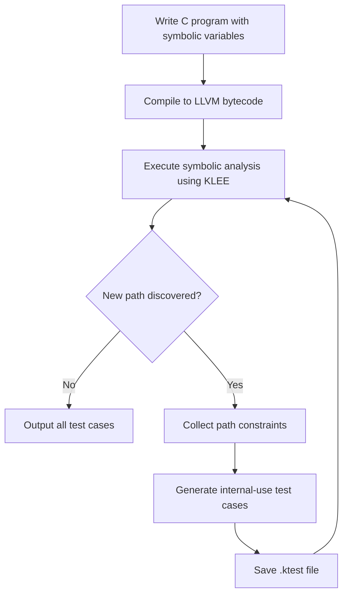

# Background and Challenges

1. Engineering Challenges
  - Difficulty in symbolizing complex structs
      • Nested structs (e.g., DeviceState containing a SensorReading array)
      •	Special types (function pointers) requiring additional handling
  - High cost of manually writing main functions
      • Separate driver code needed for each function under test

2. Validation Objective

Test whether an automated solution (symbolizer.h + code generator) can address the above pain points.
 
# Solution and Implementation Process

1. Solution Overview

For struct symbolization, two approaches exist:
•	Member-wise: Symbolize each member individually (time-consuming, error-prone).
•	Holistic: Use KLEE’s built-in klee_make_symbolic to symbolize entire structs at once.
Chosen Approach: Implement the second method (efficient, reliable, cost-effective).

To avoid manual main functions, I:
1.	Extract struct and function names via AST parsing.
2.	Populate a pre-defined main.c template.
3.	Integrate the template into the symbolic C program.
4.	Generate test cases via KLEE.

2. Detailed workflow:


# Implementation Process
1. Struct Definition
```c
typedef struct {
    uint32_t sensor_id;
    double temperature;
    uint8_t status_flags;
} SensorReading;

typedef struct {
    char device_name[32];
    SensorReading readings[5];
    uint8_t reading_count;
    void (*calibration_func)(int);
} DeviceState;
```

2. Test Function Implementation
```c
int process_device(DeviceState* device) {
if (!device) {
        return -1;
    }
    if (device->reading_count > 5) {
        return -2;
    }
    double total = 0.0;
    int valid_count = 0;
    for (uint8_t i = 0; i < device->reading_count; i++) {
        if (device->readings[i].status_flags & 0x80) {
            continue;
        }
        double temp = device->readings[i].temperature;
        if (temp < -100.0 || temp > 100.0) {
            continue;
        }
        total += temp;
        valid_count++;
    }
    if (valid_count > 0) {
        if (device->calibration_func) {
            device->calibration_func(valid_count);
        }
    }
    return 0;
}
```
3. Struct Symbolization Macro & Function
```c
#define SYMBOLIZE_STRUCT(obj, type) do { \
    __symbolize_struct_internal(&(obj), #type); \
} while (0)

void __symbolize_struct_internal(void* ptr, const char* type_name) {
    if (strcmp(type_name, "DeviceState") == 0) {
        DeviceState* ds = (DeviceState*)ptr;
        klee_make_symbolic(ds, sizeof(DeviceState), "DeviceState");
        klee_assume(ds->reading_count <= 5);
        ds->calibration_func = NULL;
    }
}
```
4. Automation via struct_analyzer.py
Python script automates main function generation .

5. Command Line Execution
```bash
python3 struct_analyzer.py complex_struct.h process_device DeviceState
clang -c -emit-llvm -g symbolizer.c -o symbolizer.bc
clang -c -emit-llvm -g -I src autogenerated_main.c -o main.bc
clang -c -emit-llvm -g -I src complex_struct.c -o complext_struct.bc
llvm-link complex_struct.bc main.bc symbolizer.bc -o combined.bc
klee --libc=uclibc --optimize combined.bc
```

All code located in src/Alexander/struct.
 
# Validation Results

|  Path   |  Instrs|  Time(s)|  ICov(%)|  BCov(%)|  ICount|  TSolver(%)|
|----------|--------|---------|---------|----------|-------|-------------------|
|klee-last|   19269|     0.65|    41.93|    29.02|    2509|       46.02|


The solution achieves 41.93% test case coverage, proving KLEE can generate test cases for complex structs. Python automation successfully replaces manual main function writing, reducing labor costs.
 
# Limitations
1.	Current coverage (41.93%) is limited. Increasing it requires manual intervention (e.g., adding a path_tracker variable to guide KLEE).
2.	Only validated for one struct and function. Application to multiple structs remains untested.
 
# Next Steps
If necessary, I'll verify KLEE’s applicability to test case generation which invovles multiple structs and functions.

