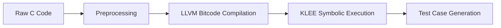

# KLEE Automated Test Case Generation Pipeline Technical Report

## Introduction
This report outlines an end-to-end pipeline for automatically generating test cases for C programs using KLEE, a symbolic execution engine. The solution uses Python scripts for automation, enabling efficient path exploration without manual test case design.

## Pipeline Architecture

The workflow comprises four sequential stages:



## Workflow

Prerequisite files:
[compile.py](https://github.com/UIUC-code/UIUC---code-translation/blob/main/src/Alexander/pipeline/compile.py)<br>
[pipeline.sh](https://github.com/UIUC-code/UIUC---code-translation/blob/main/src/Alexander/pipeline/pipeline.sh)<br>
[preprocess.py](https://github.com/UIUC-code/UIUC---code-translation/blob/main/src/Alexander/pipeline/preprocess.py)<br>
[process_test.py](https://github.com/UIUC-code/UIUC---code-translation/blob/main/src/Alexander/pipeline/process_test.py)<br>
[run_klee.py](https://github.com/UIUC-code/UIUC---code-translation/blob/main/src/Alexander/pipeline/run_klee.py)<br>

### Source Code Preprocessing​
Script: pipelines/preprocess.py

Core Functionality:

- Automatically add KLEE header dependencies
- Identify target functions (via /* KLEE_TARGET:function_name*/ comments)
- Smart main() function transformation:
    - Convert constant-initialized variables to symbolic variables
    - Automatically insert klee_make_symbolic() calls
    - Preserve original code structure and comments


​​Example Transformation​​

```c
// Before conversion 
int main() {
  int x = 5, y = 10;
  int sum = add(x, y);
  return 0;
}

// After conversion  
#include <klee/klee.h>
int main() {
  int x;
  klee_make_symbolic(&x, sizeof(x), "x");
  int y;
  klee_make_symbolic(&y, sizeof(y), "y");
  int sum = add(x, y);
  return 0;
}
```

### LLVM Bitcode Compilation​

Script: pipelines/compile.py
Core compilation Command: `clang-14 -I src -c -g -O0 -emit-llvm example.c -o example.bc`

### KLEE Symbolic Execution​

Script: pipelines/run_klee.py
Execution Command: `klee --output-dir=output_dir example.bc`

### Test Case Generation​

Conversion Tool: ktest-tool
Conversion Command: `ktest-tool test000004.ktest > test000004.txt`

Output format:

```txt
ktest file: 'klee_results/example/test000004.ktest'
args: ['bitcode/example.bc']
num objects: 2
object 0: name: 'x'
  object 0: size: 4
  object 0: data: b'\x00\x00\x00\x80'
  object 0: hex: 0x00000080
  object 0: int: -2147483648
  object 0: uint: 2147483648
  object 0: text: ....
object 1: name: 'y'
  object 1: size: 4
  object 1: data: b'\xff\xff\xff\x7f'
  object 1: hex: 0xffffff7f
  object 1: int: 2147483647
  object 1: uint: 2147483647
  object 1: text: 
```

## Example Program Analysis

### ​​Program Under Test​​

src/example.c

```c
#include <klee/klee.h>
#include <stdlib.h>

/* KLEE_TARGET: add */
int add(int a, int b) {
  if(a < 0) { a = -a; }
  if(b > 100) { return a + b; }
  return a + b;
}

int main() {
  int x = 5;
  int y = 10;
  int result = add(x, y);
  return 0;
}
```

### ​​Generated Test Cases​​

add() function test cases:

| Test ID | Input a        | Input b        |
|---------|----------------|----------------|
| TC01    | 0              | 0              |
| TC02    | -2147483648    | 2147483647     |
| TC03    | 0              | 2147483647     |
| TC04    | -2147483648    | 0              |

### ​Path Coverage Analysis​​

KLEE-generated test cases cover all branches:

1. a ≥ 0 && b ≤ 100

2. a < 0 && b ≤ 100

3. a ≥ 0 && b > 100

4. a < 0 && b > 100

## Technical Advantages

1. Systematic exploration of program paths achieves high branch coverage.
2. Fully automated test case generation from source code without manual test drivers.

## Limitations

1. Only supports symbolicization of basic data types (int/float), cannot automatically handle structs/user-defined types.
2. Generates input parameters but does not capture program execution outputs, requiring manual result verification.

## Conclusion
This KLEE test case generation pipeline provides an automated testing solution. Through symbolic execution, the system generates high-quality test cases that comprehensively cover code logic paths, making it particularly suitable for verifying algorithm components and data processing logic.