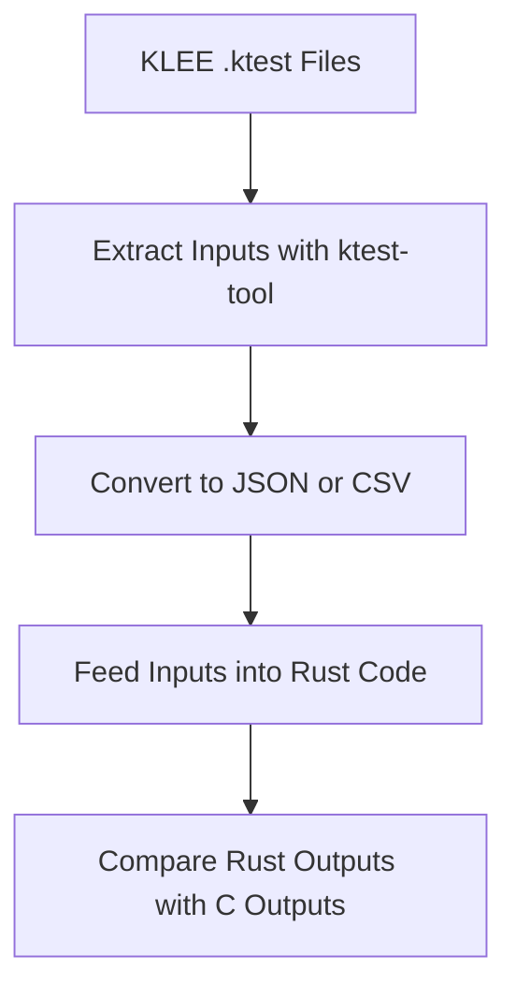

# KLEE Symbolic Execution Framework for C Function Extractor with Clang AST in Python

## Summary
This framework is designed for automated symbolic testing of C programs using Clang AST and KLEE, implemented in Python. The system automatically extracts function definitions and type information from C source code using `clang.cindex`, generates KLEE-compatible symbolic stubs, compiles the code to LLVM bitcode, and runs KLEE to generate test cases. The full pipeline is containerized via Docker for portability.

## Problems: Validating C → Rust Translation
When translating a C program to Rust (manually or using automation tools), we need to ensure that the translated Rust code behaves identically to the original C code across all input paths.

Manually testing this is error-prone and incomplete — especially when the C code contains:
- Function pointers
- Structs
- Pointers/arrays
- Control flow dependent on symbolic values

## Function & Type Features in `sample.c` Overview

According to the problems, we designed the `sample.c` to include the following features/functions.

| Feature Category             |  Function                                        | Notes                                                                   |
| ---------------------------- | --------------------------------------------------------- | ----------------------------------------------------------------------- |
| **Function Pointers**      | `void for_each(int*, int, void (*)(int))`                 | Function accepts a callback — important for symbolic selector handling. |
| **Structs**                | `typedef struct { double x; double y; } Vector2;`         | Used in `normalize_vector` to modify its fields.                        |
| **Pointers**               | `Vector2* vec`, `const char* input`, `char* copy`         | Both input and return pointers (heap, string).                          |
| **Arrays**                 | `void fill_array(int arr[], int size, int value)`         | Raw array manipulation via pointer.                                     |
| **Enum**                   | `enum Status { OK, ERROR }` used in return value          | Used to encode success/failure semantics.                               |
| **Global Variables**       | `char global_buffer[1024];`, `static int internal_state;` | KLEE can track state, but globals need special handling.                |
| **Inline Function**        | `inline int max(int a, int b)`                            | KLEE will inline this; no special treatment needed.                     |
| **Static Helper Function** | `static void log_message(const char* msg)`                | Static scope; okay as long as used locally.                             |
| **Heap Allocation**        | `char* copy = malloc(len + 1);`                           | Use symbolic string input in `duplicate_string`.                        |
| **Mathematical Functions** | `sqrt(vec->x * vec->x + vec->y * vec->y)`                 | Requires `libm` (like `sqrt(double)`) stubs or approximation.                                 |
| **Forward Declarations**   | `int multiply(int a, int b);`                             | Common in header generation.                                            |


## What Has Been Completed
1. Clang-Based Function & Type Extraction
    - Uses `clang.cindex` to parse C source files and extract:
        - Function names and return types
        - Parameter types including pointers, arrays, structs, and function pointers
    - Stores this metadata into `functions.json` for downstream use

2. Symbolic Stub Generation (`gen_klee_stubs.py`)
    - For each extracted function:
        - Generates a C stub that makes all parameters symbolic using `klee_make_symbolic()`
        - For structs and arrays, symbolic values are applied element-wise

    - Handles function pointers:
        - Automatically creates `func_handler0`, `func_handler1`, ...
        - Introduces a symbolic selector to simulate function dispatch:

            ```c
            int func_selector;
            klee_make_symbolic(&func_selector, sizeof(func_selector), "func_selector");
            klee_assume(func_selector >= 0);
            klee_assume(func_selector < 2);
            void (*func)(int) = func_selector == 0 ? func_handler0 : func_handler1;
            ```
3. Header Generation (`gen_headers.py`)
    - Currently implemented using `pycparser`
    - Generates `include/generated_funcs.h` directly from source files (`sample.c`)
    - Contains declarations of all extracted functions

4. LLVM Bitcode Compilation
    - Uses Clang (`clang -emit-llvm`) to compile:
        - Original source
        - Generated stubs
        - Stubbed standard library functions (`klee_builtin_stub.c`)
    - Since KLEE cannot directly execute dynamically linked functions like strcpy, malloc, or sqrt, I handle them by writing manual stub implementations in `klee_builtin_stub.c`, which would also be compiled to `klee_bulitin_stubs.bc` for later linking use.
    - Produces `.bc` files in `klee_stubs/llvm_bc`
    - This would be wrapped in `utils/compile_stubs.py` for compilation of multiple files

5. KLEE Execution Automation
    - Links relevant bitcode files. This is because that we extracted different stubs from raw C files (`sample.c`) in step 2, while keeping the original function definition in `sample.c`. Also, we need to link the `klee_bulitin_stubs.bc` in step 4.
    - Runs KLEE automatically for each test stub
    - Stores all outputs in `klee-out/` (symbolic test cases, warnings, assertions)

## Next Steps
### Goal
Use the test cases generated by KLEE from the original C code to **run the translated Rust code with the same inputs and verify that both behave identically**.

### Ideal Workflow Overview


1. Extract inputs using `ktest-tool`
2. Convert to test-friendly format using Python (`json` format)
3. Run tests in Rust → maybe write a Rust Test Driver
4. Compare outputs

## Reference
You can refer the [README.md](https://github.com/UIUC-code/UIUC---code-translation/tree/main/code/OscarFu/python/README.md) file for a detailed walk-through of how to set up and run the pipeline.
